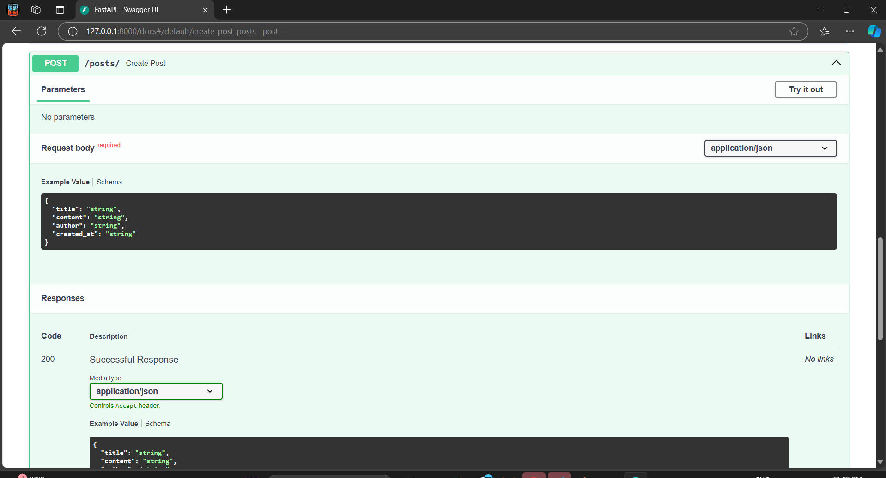

# School Blog API

This project is a simple blog API for a school, built using FastAPI and MongoDB with Motor for asynchronous database interactions. It features data validation using Pydantic.

## Features

- Create, read, update, and delete blog posts.
- Asynchronous MongoDB interaction.
- Data validation with Pydantic models.
- Auto-generated API documentation via FastAPI.

## Project Structure
    ```
    school_blog/
    ├── __pycache__/             # Compiled Python files
    ├── screenshot/              # Directory containing screenshots of the API documentation
    ├── venv/                    # Virtual environment for the project
    ├── main.py                  # Main FastAPI application file
    ├── models.py                # Defines Pydantic models for data validation
    ├── database.py              # Handles MongoDB connections and interactions
    └── routes.py                # API route definitions
    ├── requirements.txt         # Lists required Python packages
    └── README.md                # Project documentation

## Technologies Used

- **FastAPI**: For building the web API.
- **Motor**: For asynchronous MongoDB interactions.
- **Pydantic**: For data validation.
- **Uvicorn**: ASGI server to run the FastAPI app.

## Setup Instructions

### Prerequisites

- Python 3.7 or later
- MongoDB installed and running on your machine (default port 27017)

### Installation

1. Clone the repository:
    ```bash
    git clone https://github.com/01Prathamesh/school_blog.git
    cd school_blog
    ```

2. Create a virtual environment and activate it:
    ```bash
    python -m venv venv
    venv\Scripts\activate  # On Windows
    # source venv/bin/activate  # On macOS/Linux
    ```

3. Install the required packages:
    ```bash
    pip install -r requirements.txt
    ```

### Running the API

1. Start your MongoDB server if it’s not already running.

2. Run the FastAPI application:
    ```bash
    python -m uvicorn school_blog.main:app --reload

    ```

3. Access the API documentation: Open your browser and go to `http://127.0.0.1:8000/docs` to see the interactive API documentation.

## API Endpoints

- **Create a post**
    - **Endpoint**: `POST /posts/`
    - **Request Body**:
    ```json
    {
      "title": "Your Post Title",
      "content": "The content of the post",
      "author": "Author Name",
      "created_at": "2024-10-27T12:00:00Z"
    }
    ```

- **Get a post by ID**
    - **Endpoint**: `GET /posts/{post_id}`

- **Example Responses**:
    - **Success**:
    ```json
    {
      "_id": "60d5ec49f0d0b30017d4b5e1",
      "title": "Your Post Title",
      "content": "The content of the post",
      "author": "Author Name",
      "created_at": "2024-10-27T12:00:00Z"
    }
    ```
    - **Not Found**:
    ```json
    {
      "detail": "Post not found"
    }
    ```

- **Update a post**
    - **Endpoint**: `PUT /posts/{post_id}`
    - **Request Body**:
    ```json
    {
      "title": "Updated Title",
      "content": "Updated content",
      "author": "Updated Author Name"
    }
    ```

- **Delete a post**
    - **Endpoint**: `DELETE /posts/{post_id}`

## Screenshots

Here are some screenshots of the FastAPI Swagger UI:




